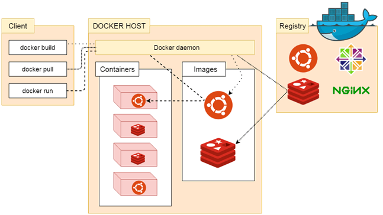

### Docker Architecture

Docker architecture consists of 

* Docker client which is shell
* Docker daemon
* Docker Registry
* Docker objects
    * Images
    * Containers
* Docker networking
* Docker storage

